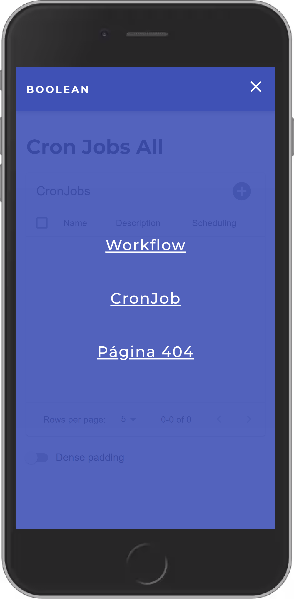
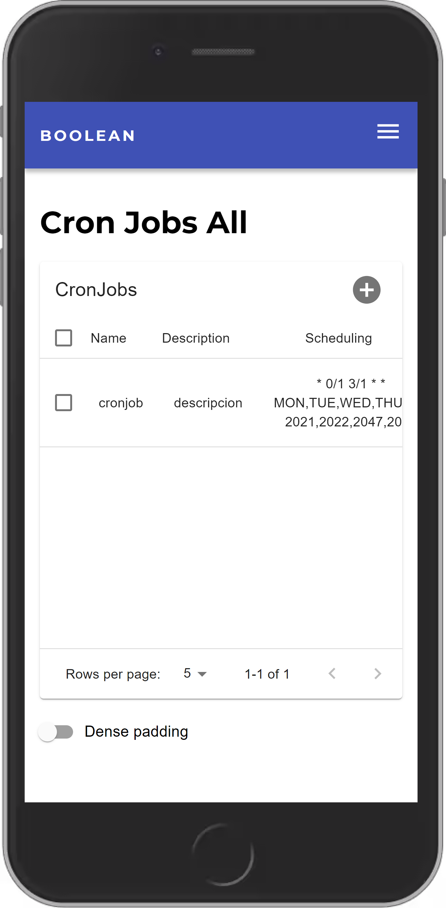
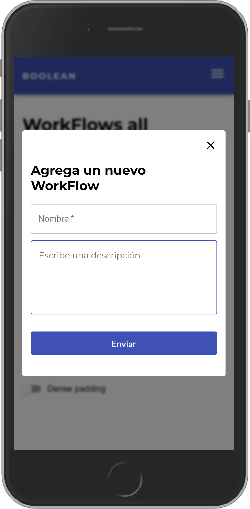
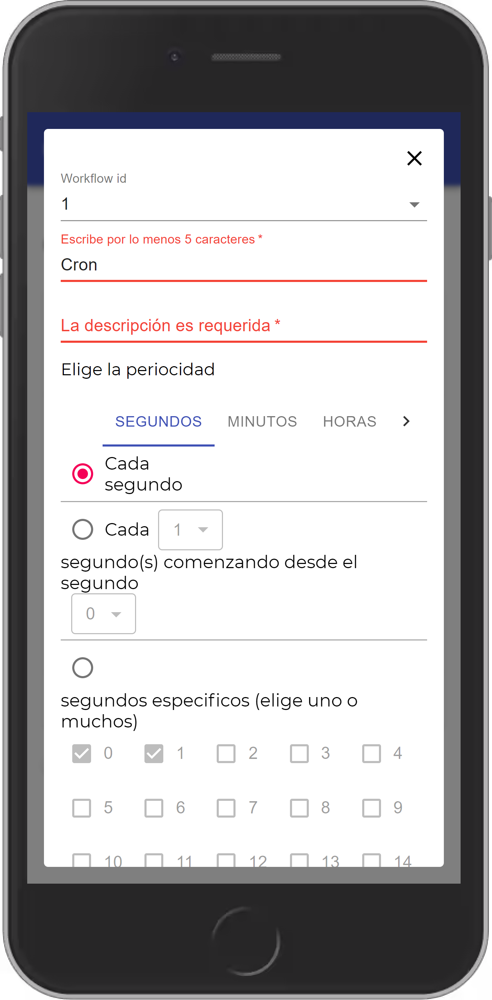
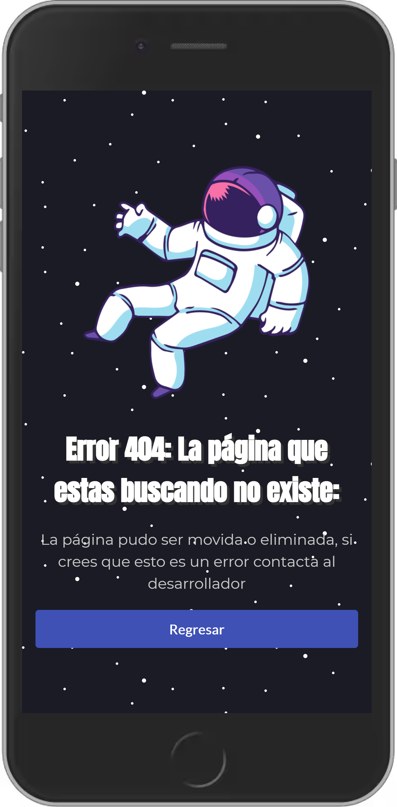

<h1 style="text-align:center;">Boolean Challenge</h1>

## Requisitos

Requiere [Nodejs 10 o posterior](https://nodejs.org/en/)

Para inicializar el proyecto es necesario crear el archivo `.env`: dentro de este archivo debemos agregar todas nuestra variables de entorno especificadas en el archivo `.env.example`

## ¿Cómo funciona?

- `yarn install` para instalar las dependencias.
- `yarn dev` para levantar el servidor de NEXTJS.
- `yarn build && yarn start` prepara la aplicación para un entorno de producción.

## Estructura del Proyecto

En este apartado vamos a hablar de la estructura del proyecto.

### components: 
Esta carpeta contiene los siguientes directorios

- **common**: En esta carpeta se encuentran todos los componentes comunes, es decir componentes que pueden ser utilizados no solo en la página como su nombre lo dice, si en cualquier lugar.
- **workflow**: En esta carpeta se encuentran los componentes que necesita la página de workflow
- **cronjob**: En esta carpeta se encuentran los componentes que necesita la página de cronjob.
- **base-styles**: Este archivo contiene definidos los estilos base del proyecto, como lo son las variables de css, los elementos generales como la etiqueta body, nav, etc.

### pages

Esta carpeta es requerida y necesaria por el framework de **NEXTJS**, ya que es el directorio donde el servidor interpreta los archivos de tipo página web.

se sobrescribió el archivo [_document](https://github.com/JasanHdz/crontab-ui/blob/master/pages/_document.js) para poder decirle a NEXTJS que sirva los estilos de **Material UI** desde el servidor, si esta configuración lo más seguro es que en la primer carga del navegador los elementos de **Material UI** no se miraran muy bien. Hasta que se hallan cargado los estilos de lado del cliente, pero no tendría sentido usar nextjs porque nuestro sitio web daría una mala experiencia a los usuarios.

también se sobrescribio el documento [_app](https://github.com/JasanHdz/crontab-ui/blob/master/pages/_app.js) para envolver el component principal con los estilos del Tema.

Adicionalmente sobrescribimos el archivo [_error](https://github.com/JasanHdz/crontab-ui/blob/master/pages/_error.js) para dar una experiencia más personalizada a los errores del servidor.

### theme

Esta carpeta contiene solo un archivo ``theme.js`` que retorna un objeto con las propiedades del tema de la aplicación, me gusta separlo porque de ese modo solo cambio alguna propiedad archivo directamente.

### utils

Creo que siempre la uso en cualquier tipo de proyecto pequeño o grande, ya que ahí me gusta poner funciones que resuelven necesidades generales que nos ayudan a tener un código más limpio y declarativo, creo que si algo se repite más de alguna vez significa que siempre hay algúna mejor manera de hacerlo. 

En este proyecto los archivos de utilidad resuelven cosas especificas, como el formato de las fechas, manejador de la sessión, cookies, objetos que retornan valores de tipo fecha, como días de la semana, meses, años, etc.

### constants

- Constantes de tipo variables de entorno
- Constantes de tipo CRONTAB

Muchos desarroladores omiten estas confuguraciones y les parecen inecesarias, pero crear constantes me han ayudado a aliviar muchos dolores de cabeza, ya que me han echo un programador más rápido y declarativo, además de que el editor me ayuda a indetificar los typos que luego suelo cometer. Sin duda las constantes no deberian faltar en cualquier proyecto.

### providers

Este directorio lo cree cuando identifique que mi initialState del formulario de crontab se estaba haciendo algo grande. Además de que el atributo scheduling es un atributo complejo y había que hacer un trabajo adicional para obtener los valores reales que necesitaban los campos del formulario crontab. Fue ahí donde tomé la desición de separar el objeto a otro nivel más abstracto y fácil de mantener. 

La idea de esta carpeta es proporcionar provedores initiales de información como en formularios o estados complejos que necesiten un tratamiento más complejo.

### hooks 

En esta carpeta coloque dos hooks importantes para el formulario de crontab: 
- **use-crontab**: ya que de acuerdo a la interfaz de la que me guie y los valores que investigue en internet. me di cuenta que los crontab seguian un patrón y decidí hacerlo de ese modo para evitar repetir código, por cada pestaña del formulario.

- **use-crontab-days**: Incluso pude haber evitado crear este hook, pero los días son un caso un poquito más complejo ya que rompian con el patrón por eso decidí crear un hook especial para resolver el problema de los días

PD: Muy probablemente para alguno que otro estos hooks pueden ser inecesarios ya que cada hook solo se utiliza una vez por un único componente. Pero lo quise hacer así porque me estresa ver tanto código amontonado. Y mucho más ver la interfaz llena de mucha lógica, por eso tomé esa decisión.

### models

Javascript es un lenguaje orientado a Prototipos y no a Objetos. Sin embargo me gusta tener un control sobre los datos que envió a mi estado y el orden de los atributos, es por ello que agregue algunos modelos, para crear instancias de estos datos.

- workflow
- workflow-list
- cronjob
- cronjob-list

### services

En este directorio van todos los servicios web de la aplicación

- createToken services
- cronjob services
- workflow services

### hoc

Casi siempre necesitamos saber cuales son los permisos de nuestros usuarios cuando queremos llamar a alguna API, y los **componentes de orden superior** nos ayudan a crear validaciones para saber si nuestros usuarios tiene algún tipo de sesión y en base a ello redirigirlos al lugar indicado de nuestra aplicación.

- authentication

Actualmente estos Hocs los resolviamos con la propiedad de **getInitialProps**, pero en las ultimas de versiones Nextjs 9 en adelante ya no recomiendan usar **getInitialProps**, en lugar de ellos recomiendan usar **getServerSideProps** o **getStaticProps**.

Es por ello que el archivo de autenticación se tiene una función que hace especie de middleware que ayuda a identificar si el cliente tiene sesión y si no la tiene crea un nuevo token y setea las cookies con el nuevo token.

Para este ejercicio el cliente siempre tiene un token válido.

### Conclusiones del Reto.

1. Al principio comencé creando una configuración básica para un proyecto en nextjs

2. instale las dependencias como ``react, react-dom, nextjs, styled-components, Material UI, cookies, isomorphic-fetch, prop-types``.

3. Cuando comencé a crear la pequeña interfaz para probar los servicios web, tenía pensado crear un especie de dropdown para resolver los problemas del crontab. Pero despues de leer un poco sobre el crontab de linux me di cuenta que hay muchas opciones y realizar un dropdown normal por cada atributo no me iba a funcionar, porque el usuario al usar un dropdown o un datepicker solo puede seleccionar 1 único valor y no un conjunto de valores, además con un datepicker, se establece una hora especifica y una fecha especifica, es por eso que ya no decidí irme por esa opción, aunque hubiera sido lo más fácil y rápido. 

Resolver este reto me pareció muy divertido, no habia creado un formulario tan complejo y digo complejo por el conjunto de opciones que representaba.

Para resolver este proyecto no ocupe ni context-api, ni redux, ya que aunque pude aplicar esos gestores de estado, no me hacia mucho sentido resolverlo así, porque no estaba ocupando el estado del formulario en ningún otro componente. 

Para resolver problemas con el formulario, me gusta obtener los valores por medio de un FormData y crear una funcion general de tipo onInput donde hago un switch de validaciones por medio del name del target.

Pero para este reto decidí usar [formik](https://formik.org/docs/overview), es muy parecida a la estrategia que uso con el target. Nunca había usado esta pequeña librería, es fácil de implementar y te ayuda a tener todo centralizado, es genial 😀.

### Algunas capturas del resultado.

